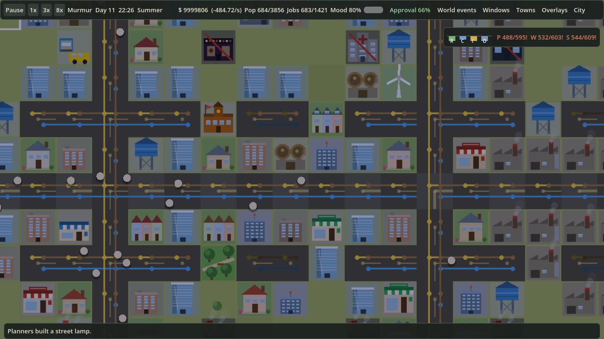

# Murmur

**A cozy, endless city-builder.** Zone, wire, pipe and plumb a town, keep its people happy, then look up: you share a river with neighbours who have opinions about your sewage.

Everything is drawn with code (no art assets), the whole game is data-driven.

| Up close | Street level | Land-value overlay |
|---|---|---|
|  |  |  |

*Captured from the game itself: a hand-built showcase town (`client/tests/showcase.gd`, about 700 residents) with the camera moved by `client/tests/reel.gd`. Planner (AI) towns stay much smaller. Retake with `scripts/MEDIA.md`.*

## What you get

| | |
|---|---|
| **Towns that grow themselves** | Zone beside roads and the planner builds homes, shops, farms, factories and services as needs arise. Or take the wheel and place everything. |
| **Multi-window** | Every HUD window can pop out into its own OS window ("Out" button) for multi-monitor play; layout is remembered. |
| **Empire view** | Run many towns at once: one window with every town's population, money, mood and alerts, one-click settings for all of them, and money transfers between your towns. Spectating opens it automatically. |
| **A living region** | Up to eight neighbouring towns trade power, water and commuters over border roads. Each runs on its own planner and has a temper. |
| **Multiplayer** | Host or join from the start menu (LAN or direct IP, up to 8 players, or a dedicated `--server`). Each player runs a town; treaties and war between players are proposals and declarations. See [docs/MULTIPLAYER.md](docs/MULTIPLAYER.md). |
| **Diplomacy and war** | Pacts, alliances, embargoes, tribute, raids and full battles with garrisons, naval yards and war weariness. |
| **Rivers that matter** | Rivers, lakes and coast from a procedural world that continues across neighbouring towns, or paint your own in the world editor. Bridges cost 4x. Fish swim; sewage kills them. |
| **Ports and fishing** | Docks need water. Cargo ships raise export income, warships guard the coast, fishing docks feed the town while the river is healthy. |
| **Three utility networks** | Power, water and sewage lines with live supply/demand, shortages, imports from neighbours and blackouts. |
| **A mayor's life** | Petitions, promises, elections every 28 days, loans, budgets, tribes with opinions, seasons, weather and disasters. |
| **Always-on information** | Demand bars (R/C/I/O), utility supply, hover cards on everything and a pinned live card when you click a tile (Inspect tool). |

## Run it

1. Install [Godot 4.7](https://godotengine.org/download) (the standard build, no .NET).
2. In the Godot project manager, import the `client/` folder. On Windows you can instead double-click `Open Murmur in Godot.bat` in the repo root: it uses the `GODOT` environment variable (full path to the Godot exe) if set, otherwise `godot` from your PATH.
3. Press Play.

Controls: WASD or arrows pan, wheel zooms, right/middle-drag pans, Space pauses, **M** zooms out to the whole region and back, **T** toggles auto-training troops, **F3** shows the performance overlay, **B** bulldozes, **F** follows the active town, **Tab** switches town, **Enter** chats in multiplayer, **F9** runs the benchmark. Towns menu > *Found a new town* lets you click a free plot anywhere on the map (the price grows with distance). All towns sit in one continuous map: pan or scroll to the next town, or click it.

## Built to stay fast

Dense late-game maps are the usual killer of city builders, so performance is priority one:

- Utility networks are solved once per layout change (content-hash cache), off-screen towns tick in batches.
- The map is chunked: zoomed in it is baked to textures, mid zoom draws block buildings, zoomed out draws flat tiles.
- Painting a road costs microseconds; the rescan is batched once per frame.

### Standard benchmark

The one number we quote: **8 towns, 8x speed, every overlay on**, spectator mode (all towns on the planner, fixed seed), 30 s fast-forward then 15 s warm-up and 30 s sampled. Run it with **F9** in game or `godot --path client -- --benchmark`; results are written to `user://benchmark.json`.

Rig: Intel i7-8700, NVIDIA GTX 1070 Ti, Godot 4.7.2 GL Compatibility, run from the editor (debugger attached, so pessimistic), 1280x720 game window. Measured 2026-10-08.

| Metric | Before (`67fd601`) | After network re-solve | Four wars, old line model | v0.2.0 (larger towns) | Four wars, v0.3 map battles |
|---|---|---|---|---|---|
| FPS (avg) | 110 | 123 | 94 | 80 | 81 |
| Frame time p99 | 22.2 ms | 16.6 ms | 21.5 ms | 30.1 ms | 30.5 ms |
| Frames over 25 ms | 18 | 2 | 9 | 61 | 63 |
| Sim cost per frame | 1.8 ms | 1.4 ms | 2.1 ms | 3.3 ms | 2.7 ms |
| Draw cost per frame | 3.6 ms | 3.7 ms | 4.6 ms | 5.6 ms | 5.5 ms |
| Draw calls (avg) | 126 | 114 | 152 | 130 | 130 |
| Total population | 612 | 608 | 448 | 781 | 530 |

Single runs. The sim is not deterministic, so population differs a little between runs (here within 1% for the first two columns); the earlier table, taken at 1706x960, read 140 fps and is not comparable. Effective speed held at 8.0x in all three. "Before" and "After" differ by the growth-only network re-solve (about 10x cheaper per growth step, `tests/netbench.gd`). The v0.2.0 column was taken after the planner learned to manage its tax rate: towns now grow to about 780 people instead of about 610, so it is *not* like-for-like with the others; per-town sim cost is higher because the towns are bigger, not because of a regression in the code (caching the coverage and shop-distance lookups cut `shops` by half and `sickness` by 4x in the same world size). The last column is the war rework (`-- --benchmark --war`): four wars are declared after the towns have grown, so marches and battles fall inside the sample (the old-model column declared them at the start, so it is not comparable). Remaining spikes are the planner and job matching; worker-thread simulation is on the roadmap.

Headless profilers (`tests/regionbench.gd`, `bench.gd`, `stageprof.gd`) are secondary: they miss rendering and frame pacing.

## Repo map

| Path | What |
|---|---|
| `client/scripts/` | The game: `catalog` (data), `city` (sim), `diplomacy`, `civics`, `events`, `art` (all drawing), `main`, `hud`, `setup` |
| `client/tests/` | Headless tests (the ones CI runs are listed in `.github/workflows/ci.yml`), profilers and the media tools `showcase.gd` / `reel.gd` |
| `.github/` | CI workflow, issue and PR templates |
| `docs/` | Design, plan, lessons, architecture ([index](docs/README.md)) |
| `docs/WIKI.md` | Design and rules, the source of truth |
| `docs/PLAN.md` | Roadmap with checkboxes |
| `docs/ARCHITECTURE.md`, `docs/LESSONS_LEARNED.md` | How it fits together, what bit us |
| `CHANGELOG.md`, `CONTRIBUTING.md`, `docs/RELEASING.md` | Process (Keep a Changelog, SemVer, `scripts/bump.py`) |

## Roadmap

Next, in order ([design](docs/EMPIRE_DESIGN.md)): an endless procedural world with founding and claiming on the map, an empire mode to run a group of towns, group-vs-group multiplayer with a shared economy, then deeper economy, infrastructure and military variety (war design: [docs/WAR_DESIGN.md](docs/WAR_DESIGN.md)). Full checklist in [`docs/PLAN.md`](docs/PLAN.md).

## Contributing

Branch from `main` (`feat/`, `fix/`, `perf/`, `chore/`), add a `CHANGELOG.md` entry under *Unreleased*, keep CI green. Details in [`CONTRIBUTING.md`](CONTRIBUTING.md).
