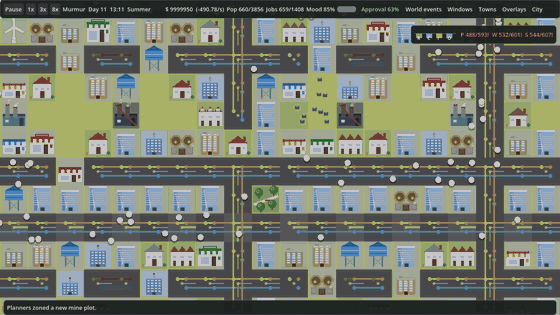
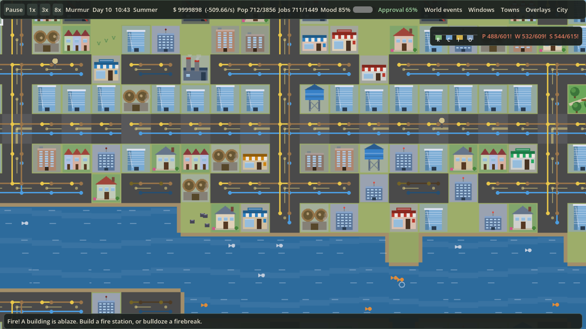
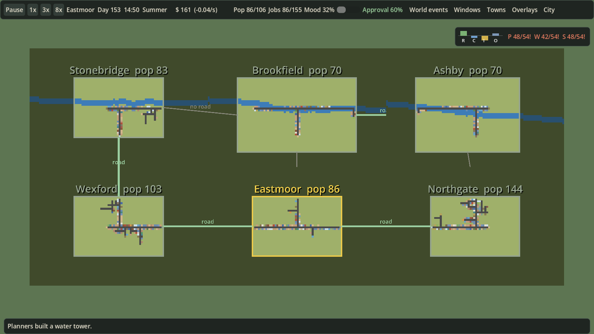
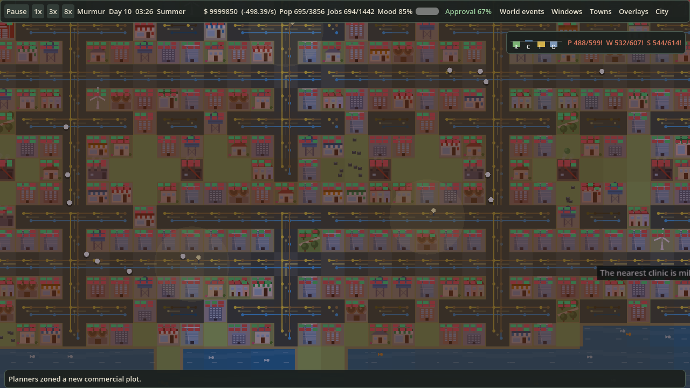

# Murmur

**A cozy, endless city-builder.** Zone, wire, pipe and plumb a town, keep its people happy, then look up: you share a river with neighbours who have opinions about your sewage.

Everything is drawn with code (no art assets), the whole game is data-driven.

| A town up close | The whole region | Coverage overlay, by a river |
|---|---|---|
|  |  |  |

*Captured from the game itself: a 6-town spectator world (planners only), fast-forwarded to day 150. Retake with `scripts/MEDIA.md`.*

## What you get

| | |
|---|---|
| **Towns that grow themselves** | Zone beside roads and the planner builds homes, shops, farms, factories and services as needs arise. Or take the wheel and place everything. |
| **A living region** | Up to eight neighbouring towns trade power, water and commuters over border roads. Each runs on its own planner and has a temper. |
| **Multiplayer** | Host or join from the start menu (LAN or direct IP, up to 8 players, or a dedicated `--server`). Each player runs a town; treaties and war between players are proposals and declarations. See [docs/MULTIPLAYER.md](docs/MULTIPLAYER.md). |
| **Diplomacy and war** | Pacts, alliances, embargoes, tribute, raids and full battles with garrisons, naval yards and war weariness. |
| **Rivers that matter** | One shared river through neighbouring towns, or paint your own in the world editor. Bridges cost 4x. Fish swim; sewage kills them. |
| **Ports and fishing** | Docks need water. Cargo ships raise export income, warships guard the coast, fishing docks feed the town while the river is healthy. |
| **Three utility networks** | Power, water and sewage lines with live supply/demand, shortages, imports from neighbours and blackouts. |
| **A mayor's life** | Petitions, promises, elections every 28 days, loans, budgets, tribes with opinions, seasons, weather and disasters. |
| **Always-on information** | Demand bars (R/C/I/O), utility supply, hover cards on everything and a pinned live card when you click a tile (Inspect tool). |

## Run it

1. Install [Godot 4.7](https://godotengine.org/download) (the standard build, no .NET).
2. In the Godot project manager, import the `client/` folder. On Windows you can instead double-click `Open Murmur in Godot.bat` in the repo root: it uses the `GODOT` environment variable (full path to the Godot exe) if set, otherwise `godot` from your PATH.
3. Press Play.

Controls: WASD or arrows pan, wheel zooms, right/middle-drag pans, Space pauses, **M** zooms out to the whole region and back, **T** toggles auto-training troops, **F3** shows the performance overlay. All towns sit in one continuous map: pan or scroll to the next town, or click it.

## Built to stay fast

Dense late-game maps are the usual killer of city builders, so performance is priority one:

- Utility networks are solved once per layout change (content-hash cache), off-screen towns tick in batches.
- The map is chunked: zoomed in it is baked to textures, mid zoom draws block buildings, zoomed out draws flat tiles.
- Painting a road costs microseconds; the rescan is batched once per frame.

### Standard benchmark

The one number we quote: **8 towns, 8x speed, every overlay on**, spectator mode (all towns on the planner, fixed seed), 30 s fast-forward then 15 s warm-up and 30 s sampled. Run it with **F9** in game or `godot --path client -- --benchmark`; results are written to `user://benchmark.json`.

Rig: Intel i7-8700, NVIDIA GTX 1070 Ti, Godot 4.7.2 GL Compatibility, run from the editor (debugger attached, so pessimistic), 1706x960 window.

| Metric | Before | After |
|---|---|---|
| FPS (avg) | 77 | 140 |
| Frame time p99 | 46.5 ms | 17.7 ms |
| Frames over 25 ms | 426 | 6 |
| Sim cost per frame | 6.0 ms | 1.3 ms |
| Render CPU / GPU | n/a | 0.7 ms / 1.4 ms |
| Draw calls (avg) | n/a | 122 |
| RAM / VRAM | 81 MB / 27 MB | 84 MB / 35 MB |

"Before" is `main` plus the benchmark harness only; "After" is `main` as of the armies, farm and planner-mining work (a single run, 702 total population across the 8 towns; the world-view build measured 107 to 111 fps on earlier runs and the build before it 128, so expect about 15% run-to-run variance). Effective speed held at 8.0x. Total population differs between builds because planner towns now have to build real border roads before they trade. Remaining spikes are ~20 ms steps (planner, job matching); worker-thread simulation is on the roadmap.

Headless profilers (`tests/regionbench.gd`, `bench.gd`, `stageprof.gd`) are secondary: they miss rendering and frame pacing.

## Repo map

| Path | What |
|---|---|
| `client/scripts/` | The game: `catalog` (data), `city` (sim), `diplomacy`, `civics`, `events`, `art` (all drawing), `main`, `hud`, `setup` |
| `client/tests/` | Smoke test and profilers (run headless in CI) |
| `.github/` | CI workflow, issue and PR templates |
| `docs/` | Design, plan, lessons, architecture ([index](docs/README.md)) |
| `docs/WIKI.md` | Design and rules, the source of truth |
| `docs/PLAN.md` | Roadmap with checkboxes |
| `docs/ARCHITECTURE.md`, `docs/LESSONS_LEARNED.md` | How it fits together, what bit us |
| `CHANGELOG.md`, `CONTRIBUTING.md`, `docs/RELEASING.md` | Process (Keep a Changelog, SemVer, `scripts/bump.py`) |

## Roadmap

Ferries, animated-tile splitting for even cheaper redraws, balance passes on diplomacy and the mayor's office, more art polish. See [`docs/PLAN.md`](docs/PLAN.md).

## Contributing

Branch from `main` (`feat/`, `fix/`, `perf/`, `chore/`), add a `CHANGELOG.md` entry under *Unreleased*, keep CI green. Details in [`CONTRIBUTING.md`](CONTRIBUTING.md).
